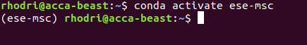

# Ubuntu (22.04 or later) setup instructions

Below are instructions for configuring a Ubuntu system. Setup in other distributions will be largely similar but you'll of course need to use that distributions package manager instead of Ubuntu's `apt`.

**Important:** Whilst the below instructions contain a reasonable amount of detail, they are not all-encompassing. If anything is unclear please ask for assistance.

We first need to ensure all our packages are up to date. In a Ubuntu terminal type
```
sudo apt update && upgrade -y
```
and enter the required credentials when prompted.

#### Microsoft Teams

Lets next install MS Teams. This can be done by opening the `Ubuntu Software` catalogue, searching for `teams-for-linux` and installing the app.

#### Install and configure `git`

From next week you'll be using `git` extensively. Lets first install it via:
```
sudo apt install git
```
To ensure we can smoothly interact with `GitHub` lets configure our user name and email address
```
git config --global user.name "Your Name"
git config --global user.email "youremail@domain.com"
```
where `Your Name` and `youremail@domain.com` should be replaced with your `GitHub` username and associated email address respectively.

#### Installing Miniconda

Lets next install [Miniconda](https://docs.conda.io/en/latest/miniconda.html). (We'll learn more about this package next week). Unfortunately we can't use the [Apt](https://ubuntu.com/server/docs/package-management) package manager for this one. To keep things clean, lets navigate to the `Downloads` folder in your home directory
```
cd ~/Downloads
```
and then download Miniconda to this folder
```
wget https://repo.anaconda.com/miniconda/Miniconda3-latest-Linux-x86_64.sh
```
Start the installation via
```
bash Miniconda3-latest-Linux-x86_64.sh
```
and follow the on-screen installation instructions. Note that simply typing `cd` in the terminal will take you back to your 'Home' directory. If your new to Terminal's, you may want to take a quick read of [this](https://ubuntu.com/tutorials/command-line-for-beginners#1-overview) tutorial. Section 4+ should prove very useful!

To ensure `conda` commands are accessible, we next need to reload our `bash` environment. This can be done by typing
```
bash
```
in the terminal. Alternatively, we can simply restart the terminal or type
```
source ~/.bashrc
```

Next we need to update `conda`
```
conda update conda
conda update --all
```

We'll now use Miniconda to create the `ese-msc` environment. You'll make use of this environment during next weeks lectures. Note that for the time being, you can simply
follow the instructions below and ensure that each step completes without error (i.e. there's no need to understand exactly what is going on) - you'll learn more
about Python environments during next weeks lectures.

To start, lets use `git` to clone the repository containing the material for next weeks lectures. Navigate to/create a folder where you want to store the lecture material.
When in the desired location ACSE students should run:
```
git clone https://github.com/ese-msc-2023/modern-programming-methods.git
```
EDSML and GEMS students:
```
git clone https://github.com/ese-msc-2023/numerical-programming-in-python.git
```
Note that when prompted to enter your username and password, the password is **not** your GitHub account password but a 'personal access token' created with suitable permissions. Instructions for creating personal access token's can be found [here](https://docs.github.com/en/authentication/keeping-your-account-and-data-secure/creating-a-personal-access-token).

This repository contains an `environment.yml` file for building the `conda` environment. Navigate into the repository (e.g. `cd modern-programming-methods`). ACSE students should then run
```
conda env create -f environment.yml
conda activate ese-msc
```
ESML and GEMS students should run
```
conda env create -f environment.yml
conda activate npp
```
You should now see the environment name displayed on the left hand side of the terminal, e.g.



To deactivate the environment you can run
```
conda deactivate
```

#### VS Code

Various editors and [IDE](https://en.wikipedia.org/wiki/Integrated_development_environment)s are available for developing your code. Generally speaking, it's worth trying a few different options and finding one you like. If you don't currently have a preferred IDE, a suggested starting point is [VS Code](https://code.visualstudio.com/).

Detailed instructions for installing VS Code on linux are provided [here](https://code.visualstudio.com/docs/setup/linux).

If you wish to make use of the side bar tools such as `Run and Debug` you'll next need to install the `Python` extension. With that installed, you'll have a 'blue' bar along the bottom with details regarding your environment. From there you'll be able to add new Python interpreters. To add you `ese-msc` environment, in terminal with the `ese-msc` environment active, run
```
which python
```
Copy the output and add that interpreter path.

Note that during lectures, to make quick changes to files, we may make use of [vim](https://en.wikipedia.org/wiki/Vim_(text_editor)). It's a useful tool to learn, but is not required and therefore please feel free to stick to editing files in a graphical editor if you prefer.

#### Docker

Docker is a useful tool that you will hear about (and at some point use) during the course. You can install it via
```bash
sudo apt install docker.io
```
Following this enter
```bash
sudo groupadd docker
sudo usermod -aG docker $USER
newgrp docker
```
To ensure everything is correctly set-up execute
```bash
docker run hello-world
```

If your Docker installation is successful you should see an output something like

> Hello from Docker!
> This message shows that your installation appears to be working correctly.
>
> To generate this message, Docker took the following steps:
>  1. The Docker client contacted the Docker daemon.
>  2. The Docker daemon pulled the "hello-world" image from the Docker Hub.
>  3. The Docker daemon created a new container from that image which runs the
>    executable that produces the output you are currently reading.
>  4. The Docker daemon streamed that output to the Docker client, which sent it
>    to your terminal.
>
> To try something more ambitious, you can run an Ubuntu container with:
>  $ docker run -it ubuntu bash
>
> Share images, automate workflows, and more with a free Docker ID:
>  https://hub.docker.com/
>
> For more examples and ideas, visit:
>  https://docs.docker.com/get-started/

If you see anything else, especially an error  please ask for help.

#### Other packages (optional for non-ACSE students)

Install the GNU `C` and `C++` compilers:
```
sudo apt install gcc g++
```
Install the Python 3 development packages:
```
sudo apt install python3-dev
```
Install the Python 3 development packages and the `venv package`:
```
sudo apt install python3-dev python3-venv
```
