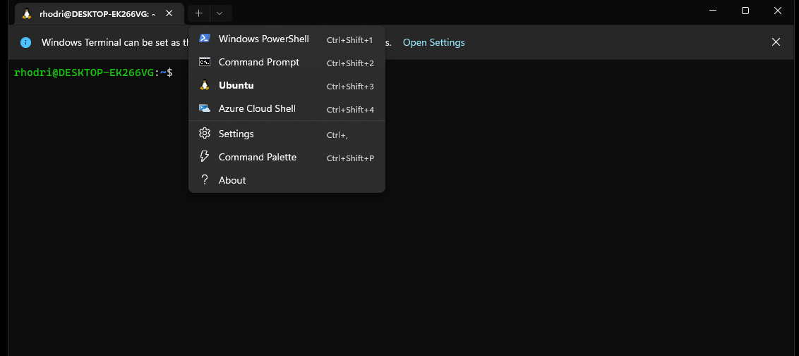

# Windows 11 setup instructions

These instructions assume you are installing software on a 2023 16GB Dell Latitude 5340 laptop (as supplied by the department). However, the instructions should largely be similar on other Windows 11 machines. Note that if you're using a Windows 10 machine, the WSL installation process may vary.

**Important:** Whilst the below instructions contain a reasonable amount of detail, they are not all-encompassing. If anything is unclear please ask for assistance.

### Initial boot up

The Dell laptops are shipped with Windows 11. Upon initial boot you will be guided through the Windows setup process. Select your language, region and keyboard. During this process you will be asked to connect to a wifi network. If you are in college, then you can connect to the "Imperial-WPA" network using your college username, which has been sent to you (it will look something like abc22 or ab622), and your college password. After the first reboot, you'll be asked to accept the MICROSOFT SOFTWARE LICENSE TERMS which you must do to proceed.

Following this, you will be asked to name your device. Enter a suitable name, continue and then your machine will reboot once again.

### Selecting Organisation

Upon rebooting you will be presented with a screen asking 'How would you like to set up this device?'. It is recommended you select the 'Set up for work or school option'. **Note** that you can select the personal account option if you wish, and this should not impede the installation process but some of the following steps may differ slightly.
After clicking 'Next', enter again your IC username and password and then follow the on-screen instructions. During this step you will be asked to make a variety of choices as to how your device functions. These choices will however not affect the following setup process.

You should now be in Windows 11. You should next ensure your system if fully up to date. To do this, go to `Start`  (the Windows icon on the bottom bar) > `Settings` > `Windows Update`  and select `Check for updates`. Install any available updates. Repeat this process until now more updates are available.

Note that:
- When first entering the `Windows Update` screen it's likely you will be told 'Windows is up to date' or similar. This however will probably not be the case, you'll need to click `Check for Updates` to ensure Windows is checking for the latest updates.
- Many drivers will most likely need to be updated. You will be prompted to restart the computer on several occasions for these updates to proceed. Note that you will need to repeat the `Check for Updates` step upon each reboot.
- The whole process will take some time (with, e.g., Cumulative updates being particularly time consuming).

Next, Dell system updates should be installed. To do this, click `Start` and then search for and open the `Dell Command | Update`. Once open, `CHECK` for updates and install any available. Note that this step may also require several reboots and you to re-`CHECK` for further updates upon each reboot.

When complete, before moving on you may wish to install the MS Teams app. To do this, open the pre-installed 'home' version of Teams, click the `Get Microsoft Teams (work or school)` and then follow the instructions. Ensure you're able to login using your Imperial College credentials.

Once your computer is up-to-date, you're ready to proceed to the main set-up instructions.

### WSL (Windows Subsystem for Linux) version 2 installation

If installing on a departmental provided machine (or a WSL2 ready Windows 11 machine) you can follow the instructions below. Otherwise, please see Microsoft's instructions for installing WSL [here](https://learn.microsoft.com/en-us/windows/wsl/install).

First open a `Windows PowerShell` terminal with administrator privileges (locate the app, right click and then select `Run as Administrator`). In the opened terminal type
```
wsl --install
```
If the installation has been successful, you will be promoted to reboot your system.
After the reboot a `Ubuntu` terminal will load. After a couple of minutes you will be prompted to `Enter new UNIX username:`. Choose a username (your short IC username is a suitable choice) and press `Enter`. **IMPORTANT** Pressing enter without choosing a username will set the default user as `root`. This will cause many issues and hence you should ensure an appropriate username is selected before continuing.

Ubuntu should now be installed on your machine. To check all is so far so good, in a PowerShell (not the Ubuntu terminal) terminal type
```
wsl -l -v
```
You should see an output along the lines of
```
 NAME      STATE           VERSION
*Ubuntu    Running         2
```
You will now have the `Ubuntu on Windows` app available, and running it will open a terminal allowing you to interact with the Ubuntu installation. However, we recommend you now install the `Terminal` app which offers a cleaner interface. To do this, open the `Microsoft Store`, search for the `Windows Terminal` app and install it.

Once installed, we need to open the `Terminal` app and set its default mode to Ubuntu. It can be found by searching for the `Terminal` app:


Once open, click on the drop down arrow next the terminal tab and open the app settings:



Then, on the `Startup` tab located on the left hand side set `Default profile` to Ubuntu and save the settings:


Opening a new tab (or restarting the app) will then give us access to the WSL Ubuntu distribution. We're now ready to start configuring our Ubuntu installation.

### Configuring Ubuntu

We first need to ensure all our packages are up to date. In a Ubuntu terminal type
```
sudo apt update && sudo apt upgrade -y
```
and enter the required credentials when prompted.

#### Install and configure `git`

From next week you'll be using `git` extensively. Lets first install it via:
```
sudo apt install git
```
To ensure we can smoothly interact with `GitHub` lets configure our user name and email address
```
git config --global user.name "Your Name"
git config --global user.email "youremail@domain.com"
```
where `Your Name` and `youremail@domain.com` should be replaced with your `GitHub` username and associated email address respectively.

#### Installing Miniconda

Lets next install [Miniconda](https://docs.conda.io/en/latest/miniconda.html). (We'll learn more about this package next week). Unfortunately we can't use the [Apt](https://ubuntu.com/server/docs/package-management) package manager for this one. To keep things clean, lets first make a new folder called `downloads`
```
mkdir downloads
```
and navigate to it via
```
cd downloads
```
Now, lets download Miniconda to this folder
```
wget https://repo.anaconda.com/miniconda/Miniconda3-latest-Linux-x86_64.sh
```
Then start the installation via
```
bash Miniconda3-latest-Linux-x86_64.sh
```
and follow the on-screen installation instructions. When prompted `Do you wish the installer to initialize Miniconda3 by running conda init?` it's recommended you enter `yes`.
Note that simply typing `cd` in the terminal will take you back to your 'Home' directory. If you're new to terminals, you may want to take a quick read of [this](https://ubuntu.com/tutorials/command-line-for-beginners#1-overview) tutorial. Section 4+ should prove very useful!

To ensure `conda` commands are accessible, we next need to reload our `bash` environment. This can be done by typing
```
bash
```
in the terminal. Alternatively, we can simply restart the terminal or type
```
source ~/.bashrc
```

Next we need to update `conda`
```
conda update conda
conda update --all
```

We'll now use Miniconda to create the `ese-msc` environment. You'll make use of this environment during next weeks lectures. Note that for the time being, you can simply
follow the instructions below and ensure that each step completes without error (i.e. there's no need to understand exactly what is going on) - you'll learn more
about Python environments during next weeks lectures.

To start, lets use `git` to clone the repository containing the material for next weeks lectures. Navigate to/create a folder where you want to store the lecture material.
When in the desired location ACSE students should run:
```
git clone https://github.com/ese-msc-2023/modern-programming-methods.git
```
EDSML and GEMS students:
```
git clone https://github.com/ese-msc-2023/numerical-programming-in-python.git
```
Note that when prompted to enter your username and password, the password is **not** your GitHub account password but a 'personal access token' created with suitable permissions. Instructions for creating personal access token's can be found [here](https://docs.github.com/en/authentication/keeping-your-account-and-data-secure/creating-a-personal-access-token).

This repository contains an `environment.yml` file for building the `conda` environment. Navigate into the repository (e.g. `cd modern-programming-methods`). ACSE students should then run
```
conda env create -f environment.yml
conda activate ese-msc
```
ESML and GEMS students should run
```
conda env create -f environment.yml
conda activate npp
```
You should now see the environment name displayed on the left hand side of the terminal, e.g.


To deactivate the environment you can run
```
conda deactivate
```

#### VS Code

Various editors and [IDE](https://en.wikipedia.org/wiki/Integrated_development_environment)s are available for developing your code. Generally speaking, it's worth trying a few different options and finding one you like. If you don't currently have a preferred IDE, a suggested starting point is [VS Code](https://code.visualstudio.com/).

From the VS Code link, you can download and install the `Stable Build` for Windows (x64). Once installation is complete, open VS Code and install the `WSL` extension (you'll find the extension's tab on the left hand side of your screen). With that extension installed, on the green connect button in the bottom left, you'll now have the option to open a `New WSL Window`. When you choose this and it successfully connects it will similar to the following:


You'll now be able to easily open files on your WSL installation and also open a WSL terminal (click on the button with  three horizontal lines, top bar on the left, `Terminal->New Terminal`).

You should next (in the `WSL:Ubuntu` VScode) install the `Python` extension. This will also allow you to make use of side bar tools such as `Run and Debug`. With that installed, (when you have a Python file open) you'll have a bar along the bottom of the VS Code window with details regarding your environment. Further, with an open Python file you can use this bottom bar to add new Python interpreters. The conda environment created above (`ese-msc` or `npp`) should be one of the interpreters you're able to select by default. If not, to add it open/create a new python file (if you didn't have one open already) and then in a WSL terminal with the `ese-msc` environment active, run
```
which python
```
Copy the output and add that interpreter path.

Note that during lectures, to make quick changes to files, we may make use of [vim](https://en.wikipedia.org/wiki/Vim_(text_editor)). It's a useful tool to learn, but is not required and therefore please feel free to stick to editing files in a graphical editor if you prefer.

#### Configuring Jupyter

**WARNING**: This step is a bit of a hassle but will help makes your lives easier! Be sure to follow the instructions *step-by-step* to avoid damaging your setup. If you have a favourite web-browser and it's not currently installed on your system, install it before continuing.

In a WSL terminal, ensure your `ese-msc`/`npp` environment is active. Next run
```
jupyter notebook --generate-config
```
The output will tell you where the config file has been written to. Open this file in `VS Code` or some other editor of your choice. Find the line containing `c.NotebookApp.use_redirect_file` and ensure it's value is set to `False`. By default it will something like `# c.NotebookApp.use_redirect_file = True`, change it to
```
c.NotebookApp.use_redirect_file = False
```
**Note that the # has been deleted!** Next, in your `.bashrc` file (located in your home directory) add an export to the browser of your choice. My preferred browser is Firefox and hence my export looks like the following
```
export BROWSER="/mnt/c/Program Files/Mozilla Firefox/firefox.exe"
```
You'll need to change the above command to `export BROWSER="/mnt/c/path_to_my_browser/my_browser.exe`. After this line has been added, save the file and exit. Then, in the terminal type
```
bash
```
(which will reload your bash profile with this export now active). To ensure all has been successful run
```
echo $BROWSER
```
It should display the path entered above!

Now, reactivate your `ese-msc`/`npp` environment. Then run
```
jupyter notebook password
```
and choose some memorable password.

Finally, in the terminal type
```
jupyter notebook
```
and ensure a Jupyter server loads in your desired browser.

#### Docker

Docker is a useful tool that you will hear about (and at some point use) during the course. Detailed instructions regarding installing Docker and enabling the WSL 2 backend can be found [here](https://learn.microsoft.com/en-us/windows/wsl/tutorials/wsl-containers#install-docker-desktop). Pay particular attention to steps 3 and 4 to ensure the WSL engine is correctly set up, and verify a working setup through following steps 5 and 6.

#### Other packages (optional for non-ACSE students)

Install the GNU `C` and `C++` compilers:
```
sudo apt install gcc g++
```
Install the Python 3 development packages and the `venv package`:
```
sudo apt install python3-dev python3-venv
```
